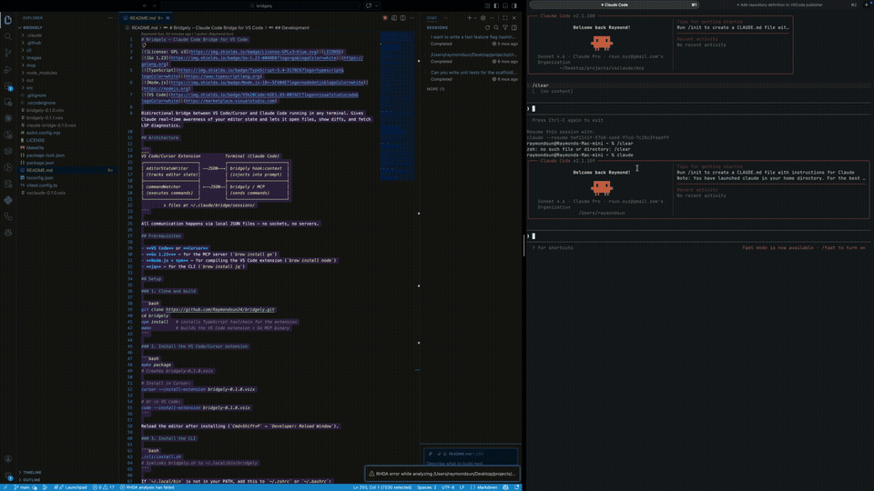
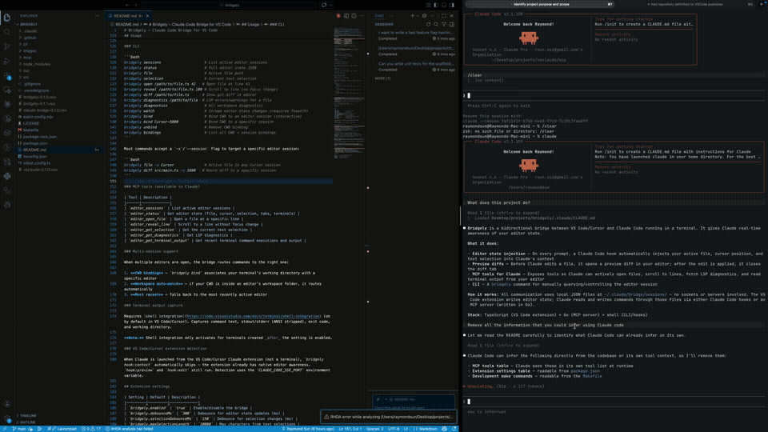

# Bridgely – Claude Code Bridge for VS Code

[](LICENSE)
[](https://golang.org)
[](https://www.typescriptlang.org)
[](https://nodejs.org)
[](https://marketplace.visualstudio.com)

> **Migration notice:** The `bridgely` CLI has been removed. All functionality is now available as MCP tools — no shell scripts, no `jq` dependency, no hooks. See [Migrating from the CLI](#migrating-from-the-cli) if you used a previous version.

> **Status:** Claude Code now ships a built-in **Auto-connect to IDE (external terminal)** setting (`/config`) that covers the core use case this project was built for. As a result, active maintenance here will wind down. The project remains open — feel free to explore, fork, and contribute if you find it useful.
>
> Bridgely still adds a couple of things the built-in doesn't: **automatic session binding** (routes Claude to the right editor when multiple are open) and **terminal output capture** (read recent command output directly from the integrated terminal — VS Code/Cursor only for now).

Bidirectional bridge between VS Code/Cursor/JetBrains and Claude Code running in any terminal. Gives Claude real-time awareness of your editor state and lets it open files, show diffs, and fetch LSP diagnostics.

## Demo

**Claude reading your active file and selection**



**VS Code showing proposed changes from Claude**



## Why

When using Claude Code, you have two options — and both involve a trade-off:

- **Use the VS Code/Cursor Claude Code extension.** Claude knows exactly what file you have open, where your cursor is, and what you've selected. But you're stuck using the built-in terminal emulator, which is sluggish, limited in features, and not where you want to spend your day.
- **Run Claude Code in an external terminal like Ghostty.** You get a snappy, fully-featured terminal experience. But Claude loses all editor awareness — it doesn't know what you're looking at, can't tell where your cursor is, and can't open files or diffs back in your editor.

There's no option that gives you both.

Bridgely fixes that. You run Claude Code in whatever terminal you want, and the bridge keeps your editor and Claude in sync — Claude sees your active file and selection, and can open files, preview diffs, and pull LSP diagnostics directly in your editor.

## IDE Support

| IDE | Status |
|-----|--------|
| VS Code | Stable (published to Marketplace) |
| Cursor | Stable (same extension as VS Code) |
| IntelliJ IDEA | In development (`jetbrains-plugin/`) |
| PyCharm, WebStorm, GoLand, PhpStorm, CLion, Rider | Covered by same JetBrains plugin |

## Architecture

```
VS Code / Cursor / JetBrains        Terminal (Claude Code)
┌──────────────────────────┐        ┌────────────────────────────┐
│ editorStateWriter        │─JSON──▶│                            │
│ (tracks editor state)    │        │   Bridgely MCP server      │
├──────────────────────────┤        │   13 tools for Claude      │
│ commandWatcher           │◀─JSON──│                            │
│ (executes commands)      │        └────────────────────────────┘
└──────────────────────────┘
        ↕ files in ~/.claude/bridge/sessions/
```

All communication happens via local JSON files — no sockets, no servers, no daemons.

## Prerequisites

- **VS Code**, **Cursor**, or a JetBrains IDE
- **Go 1.23+** — for the MCP server (`brew install go`)

## Setup

### 1. Install the VS Code/Cursor extension

Search for **Bridgely** in the Extensions Marketplace and install it, or:

```bash
# VS Code:
code --install-extension Raymondsun24.bridgely

# Cursor:
cursor --install-extension Raymondsun24.bridgely
```

Reload the editor after installing (`Cmd+Shift+P` → `Developer: Reload Window`).

For JetBrains IDEs, see [`jetbrains-plugin/README.md`](jetbrains-plugin/README.md).

### 2. Build the MCP server

```bash
git clone https://github.com/Raymondsun24/bridgely.git
cd bridgely
make mcp   # builds mcp/bridgely
```

### 3. Register the MCP server with Claude Code

Run this from the cloned directory:

```bash
claude mcp add bridgely -- "$(pwd)/mcp/bridgely"
```

### 4. Configure hooks for automatic diff previews

Add the following to `~/.claude/settings.json` to automatically show a diff preview before every edit and close it after:

```json
{
  "hooks": {
    "PreToolUse": [
      {
        "matcher": "Edit|Write",
        "hooks": [
          {
            "type": "mcp_tool",
            "server": "bridgely",
            "tool": "editor_preview_edit",
            "input": {
              "file_path": "${tool_input.file_path}",
              "tool_name": "${tool_name}",
              "old_string": "${tool_input.old_string}",
              "new_string": "${tool_input.new_string}",
              "content": "${tool_input.content}"
            }
          }
        ]
      }
    ],
    "PostToolUse": [
      {
        "matcher": "Edit|Write",
        "hooks": [{ "type": "mcp_tool", "server": "bridgely", "tool": "editor_close_preview" }]
      }
    ]
  }
}
```

Both hooks use the native `mcp_tool` type (available since Claude Code v2.1.118). The `input` field supports `${tool_input.*}` template variables, which Claude Code substitutes with the triggering tool's actual arguments at runtime — so `file_path`, `old_string`, `new_string`, and `content` are forwarded automatically with no shell script involved.

| Hook | Trigger | What it does |
|------|---------|-------------|
| `editor_preview_edit` | Before every Edit/Write | Opens a side-by-side diff preview of the proposed change |
| `editor_close_preview` | After every Edit/Write | Closes the preview diff tab |

### 5. (Optional) Allow MCP tools without permission prompts

Add to `~/.claude/settings.json` under `"permissions" > "allow"`:

```json
"mcp__bridgely__*"
```

## Usage

All editor interaction goes through MCP tools that Claude calls directly. Claude automatically checks editor state at the start of each conversation and before edits.

### Available MCP tools

| Tool | Description |
|------|-------------|
| `editor_sessions` | List all active editor sessions |
| `editor_status` | Full editor state: active file, cursor, selection, open tabs, workspace |
| `editor_get_selection` | Current text selection |
| `editor_open_file` | Open a file at a specific line and column |
| `editor_reveal_line` | Scroll to a line without stealing focus |
| `editor_get_diagnostics` | LSP errors/warnings for a file or the whole workspace |
| `editor_get_terminal_output` | Recent terminal command executions and output |
| `editor_preview_edit` | Show a side-by-side diff preview before applying an edit |
| `editor_close_preview` | Close the preview diff tab |
| `editor_show_diff` | Show the git diff for a file in the SCM view |
| `editor_bind` | Bind a directory to a specific session |
| `editor_unbind` | Remove a directory→session binding |
| `editor_list_bindings` | List all directory→session bindings |

### Multi-session support

When multiple editors are open, the MCP server routes to the right session:

1. **Directory binding** — `editor_bind` associates a directory with a specific session. Uses longest-prefix matching, so `/projects/sub` takes priority over `/projects` when you're deeper in the tree.
2. **Most recent** — falls back to the most recently active editor.

To bind the current directory to a session:

```
Ask Claude: "Bind this directory to my VS Code session"
```

Claude will call `editor_sessions` to list options, then `editor_bind` to set the binding.

### Terminal output capture

Requires [shell integration](https://code.visualstudio.com/docs/terminal/shell-integration) (on by default in VS Code/Cursor). Captures command text, stdout/stderr (ANSI stripped), exit code, and working directory.

> **Note:** Shell integration only activates for terminals created *after* the setting is enabled.

> **JetBrains:** Terminal output capture is not yet implemented. The JetBrains platform does not expose a public shell-integration API equivalent to VS Code's `onDidEndTerminalShellExecution`. Tracked as a future improvement.

## Migrating from the CLI

If you used a version of Bridgely that included the `bridgely` CLI:

**1. Remove any hooks from `~/.claude/settings.json`:**

```json
"hooks": {
  "UserPromptSubmit": [...],   // ← remove
  "PreToolUse": [...],         // ← remove
  "PostToolUse": [...]         // ← remove
}
```

**2. Remove the CLI symlink:**

```bash
rm ~/.local/bin/bridgely
```

**3. Register the MCP server (if you haven't already):**

```bash
claude mcp add bridgely -- "/path/to/bridgely/mcp/bridgely"
```

This is what replaces the hooks — Claude now calls MCP tools directly instead of running shell commands.

**4. Everything the CLI did is now an MCP tool:**

| Old CLI command | New MCP tool |
|----------------|--------------|
| `bridgely sessions` | `editor_sessions` |
| `bridgely status` | `editor_status` |
| `bridgely file` / `bridgely selection` | `editor_status` / `editor_get_selection` |
| `bridgely open <path> <line>` | `editor_open_file` |
| `bridgely reveal <path> <line>` | `editor_reveal_line` |
| `bridgely diff <path>` | `editor_show_diff` |
| `bridgely diagnostics` | `editor_get_diagnostics` |
| `bridgely preview` | `editor_preview_edit` |
| `bridgely close-preview` | `editor_close_preview` |
| `bridgely bind` / `unbind` / `bindings` | `editor_bind` / `editor_unbind` / `editor_list_bindings` |
| `bridgely hook:context` | Claude calls `editor_status` proactively |
| `bridgely hook:preview` / `hook:edit` | Claude calls `editor_preview_edit` / `editor_close_preview` |

## JetBrains Plugin

See [`jetbrains-plugin/README.md`](jetbrains-plugin/README.md) for installation and setup.
